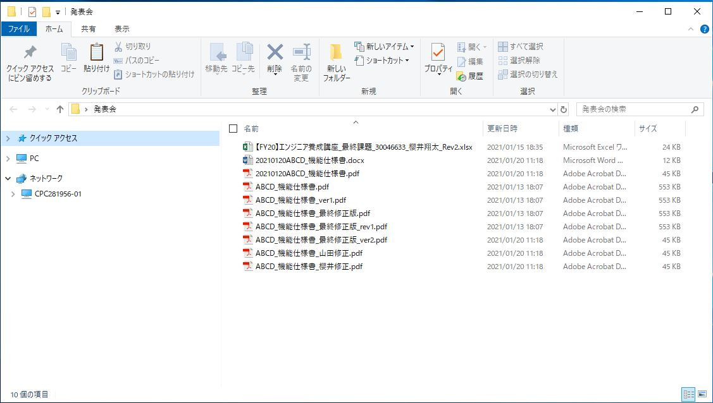
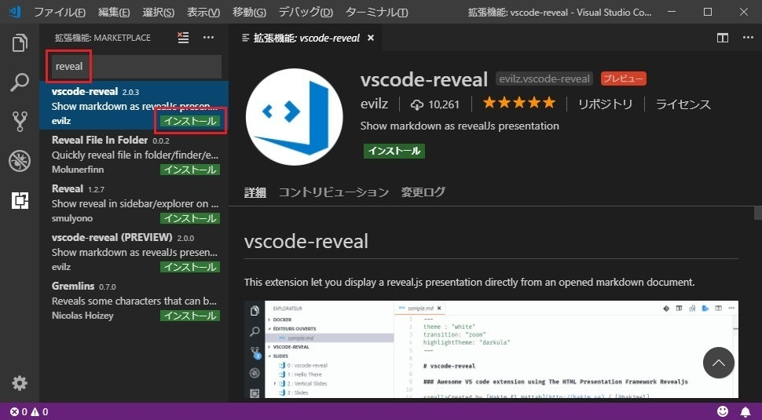

## どうしてファイル名で<br>バージョン管理をするの？
#### -20210214仕様書最終修正版Ver5_Rev2.pdf-

---

# 自己紹介

name:櫻井翔太<br>

age :21<br>

like:観光,食事<br>

LT経験:高専カンファレンス<br>

プレゼン経験:全国高専プログラミングコンテスト


---

## 発表コンセプト:
### LT(Lightning Talks)のようなゆるさで
### 誰でもできる技術を紹介

---

### なんの変哲もないフォルダ


--

# で、結局どれが<br>最終版なん？

--

# 探す気が起きない

--

## 原因
* 作った本人はわかっているから{.fragment .fade-in-then-semi-out}
* 今までもずっとこのやり方だったから{.fragment .fade-in-then-semi-out}
* Officeのファイルだから{.fragment .fade-in-then-semi-out}

---

# バージョン管理
# しません？

---

## バージョン管理システム
* Subversion
* Git

---

## 利点
* 履歴管理{.fragment .fade-in-then-semi-out}
* リリース管理{.fragment .fade-in-then-semi-out}
* 機能管理{.fragment .fade-in-then-semi-out}

---

## プログラミングチックな
## 資料作成…？

---

# MarkDown
# が好き！
## (唐突な宣伝)

--

# MarkDownって？

--

## 文書を記述するための
## 軽量マークアップ言語

* 手軽に文章構造を明示できる{.fragment .fade-in-then-semi-out}
* 簡単で、覚えやすい{.fragment .fade-in-then-semi-out}
* 読み書きに特別なアプリを必要としない{.fragment .fade-in-then-semi-out}
* 対応アプリを使えば快適に読み書きできる{.fragment .fade-in-then-semi-out}

---

## MarkDownで資料作れたら最高では？

--

# reveal.js

--

## HTMLを使用して資料を
## 簡単に作成するための
## フレームワーク{.fragment .highlight-red}

--

# 特徴
* Markdown対応 {.fragment .fade-in-then-semi-out}
* ネストしたスライド {.fragment .fade-in-then-semi-out}
* PDFエクスポート {.fragment .fade-in-then-semi-out}
* スピーカーノート {.fragment .fade-in-then-semi-out}
* JavaScript API {.fragment .fade-in-then-semi-out}

---

## 導入

Visual Stuio Codeの拡張機能
「vscode-reveal」


---

### 配布したファイルが
### 今使用しているプレゼン資料です

```
# 特徴
* Markdown対応 {.fragment .fade-in-then-semi-out}
* ネストしたスライド {.fragment .fade-in-then-semi-out}
* PDFエクスポート {.fragment .fade-in-then-semi-out}
* スピーカーノート {.fragment .fade-in-then-semi-out}
* JavaScript API {.fragment .fade-in-then-semi-out}
```

--

表も作れる
|  A  |  B  |  C  |
|:----|:---:|----:|
|  ○  |  ×  |  ×  |
|  ×  |  ○  |  ×  |
|  ×  |  ×  |  ○  |

--

画像も使える


--

<!-- .slide: data-background="#f5deb3" -->
背景色も変えられる

---

# Merkdown+reveal.js
## でスライド作り

---

# 参考文献
* https://revealjs.com/
* https://qiita.com/myname6c7c2/items/1d8c434f14dfe8f273a6

---

## 終わり

### ご清聴ありがとうございました